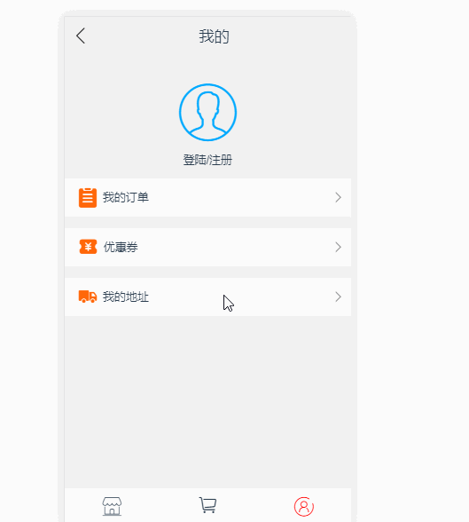

# CascadingPicker


> Description: 基于vue2的三级联动选择器，支持自定义数据，默认提供地址三级联动数据

> Author: Alan Chen

> Contact: 739709491@qq.com

> Version: 0.2.2

> Date: 2018/10/15

> 插件只适配移动端，而且必须要用rem布局(设置html标签的font-size)
# Update Logs
* 新增data的prop，支持自定义三级联动数据，默认提供地址联动的数据`AddressData.js`
* 新增inital的prop，支持默认选中初始值



# Usage:
1. 通过npm安装：`yarn add cascading-picker or npm install cascading-picker --save`
2. 在SPA里模块引入或通过script标签引入, 然后直接使用组件
```js
    // SPA模块引入. main.js
    import Vue from 'vue'
    import CascadingPicker from 'cascading-picker'
    import 'cascading-picker/dist/CascadingPicker.css'

    // 插件使用时提供一个name属性用于更改组件注册的名称，默认名称为CascadingPicker，主要是为了避免和其他ui库命名冲突
    Vue.use(CascadingPicker, {
        name: 'AlanCascadingPicker' // 此时组件注册后的名称为AlanCascadingPicker
    })
```
```html
    // html引入script标签
    <link rel="stylesheet" href="node_modules/cascading-picker/dist/CascadingPicker.css"></link >
    <script src="node_modules/cascading-picker/dist/CascadingPicker.js"></script>
```
```js
    // 必须先使用rem布局，App.vue
    export default {
        name: 'App',
        created() {
            // 手动实现的基于750像素设计图rem布局
            const doc = document.documentElement || document.body
            const docH = doc.getBoundingClientRect().width/7.5
            doc.style.fontSize = docH + 'px'
        }
    }

    // 在其他组件中直接使用CascadingPicker
    <template>
        <CascadingPicker 
            v-model="isPicker"
            :data="addressData"
            :initial="initial"
            closeOnClickModal
            @ok="selectAddress"
            @cancel="cancelAddress"
        />
    </template>

    <script>
        import addressData from 'cascading-picker/dist/AddressData'
        export default {
            name: 'example',
            data() {
                return {
                    isPicker: false,
                    addressData: addressData,
                    initial: {
                        first: '湖北',
                        second: '武汉市',
                        third: '洪山区'
                    }
                }
            },
            methods: {
                selectAddress(res) {
                    console.log(`你选中的是：${res.first},${res.second},${res.third}`)
                },
                cancelAddress() {   
                    console.log('你取消了地址选择器')
                }
            }
        }
    </script>

```
# Component options
## props
* data `[Array]` 必选，三级联动的数据，可以选择插件提供的`AddressData`，或手动书写，但格式和key必须与`AddressData`一致
* value `[Boolean]` 可选，控制地址选择器显示与否,可以使用v-model绑定变量，默认为false
* initial `[Object]` 可选，格式为{first:'', second: '', third: ''}，对应的value必须是data中的字符串，如果不是，则默认显示第一条 
* closeOnClickModal `[Boolean]` 可选，是否能够点击遮罩层来关闭，默认为false

## emit events
* ok，点击确定按钮触发。返回一个参数，格式为{first: '', second: '', third: ''}，为选中的值
* cancel，点击取消按钮触发(如果closeOnClickModal为true，点击遮罩层也会触发)，如果开启closeOnClickModal也会触发，无参数返回值

## slots
* okText, 字符串，点击右侧确定按钮的文本
* cancelText, 字符串，点击左侧取消按钮的文本

# Somethind to say
* 这个插件原本只是我很早之前写的，所以就没提供npm包，但是后来看到越来越多人给我发邮件，或提issue，或找我qq聊天询问一些问题，意识到还是有很多人对这个组件有需求。再三思考后，决定对组件进行功能优化和轻量重构，现在提供自定义数据，提供v-model绑定，提供默认选中值，这些改变都是为了更好的开发体验。
* 很多人遇到的组件无法滚动问题，其实是移动端布局问题。必须声明这个组件是基于rem布局，为什么我一定要用rem布局？首先rem布局比普通百分比布局(或栅格响应式)体验更好。主流布局基本是纯rem或类似于手淘`flexible.js`的rem和viewport动态缩放一起使用。我很早之前在做移动端页面开发(app内嵌),在非常老的webview内使用rem布局是完全没有兼容问题的。所以我推荐大家使用rem布局(或直接使用`flexible.js`)
* 另外推荐大家可以使用我的另外两个开源插件[v-scoller](https://github.com/alanchenchen/v-scroller)和[vue2-dialog](https://github.com/alanchenchen/vue2-dialog)，后者本身是对常用弹窗和滚动组件的集合。Thanks！
